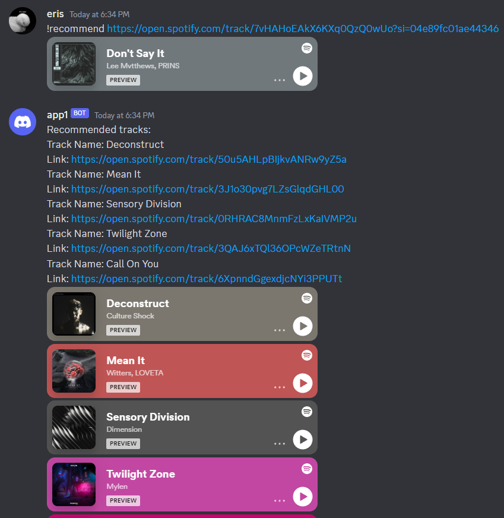
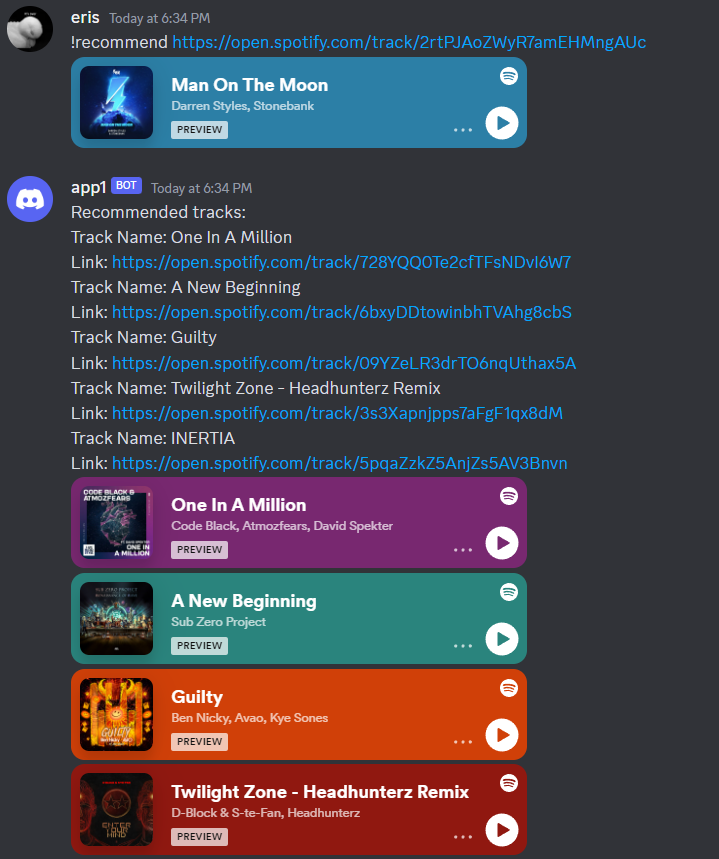

# DiscordSpotifyBot
This Discord bot is designed to recommend similar tracks to a given Spotify track. It uses the Spotify Web API to retrieve audio features of the track, and then generates a list of recommended tracks based on those features.

## Prerequisites
A Spotify developer account with a registered application.
A Discord account with a registered bot.
Node.js installed on your machine.
## Installation
Clone the repository to your local machine.
Install the required dependencies by running the following command in your terminal:
```
npm install spotify-web-api-node
npm install discord.js
```

Create a file called .env in the root directory of the project and add the following environment variables:
```
SPOTIFY_CLIENT_ID=<Your Spotify client ID>
SPOTIFY_CLIENT_SECRET=<Your Spotify client secret>
DISCORD_TOKEN=<Your Discord bot token>
DISCORD_GUILD_ID=<Your Discord guild ID>
DISCORD_CLIENT_ID=<Your Discord client ID>
```
Start the bot by running the following command in your terminal:
```
node index.js
```
## Usage
To use the bot, simply send a message to a Discord channel with the following command:
```
!recommend <Spotify track link>
```
The bot will respond with a list of 5 recommended tracks based on the audio features of the given track.
## Example usage
```
!recommend https://open.spotify.com/track/7vHAHoEAkX6KXq0QzQ0wUo?si=04e89fc01ae44346
```

```
!recommend https://open.spotify.com/track/2rtPJAoZWyR7amEHMngAUc
```



## Credits
This bot was created by Minsu Kim as part of a personal project.
